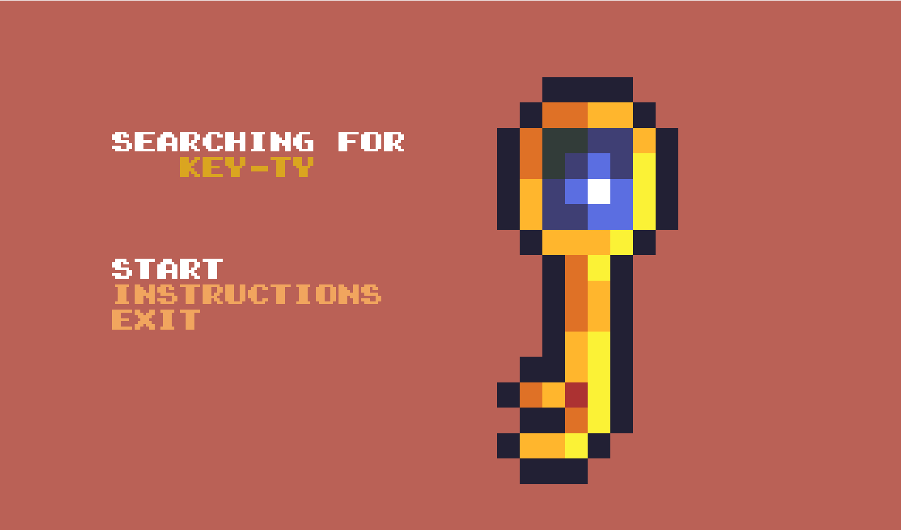
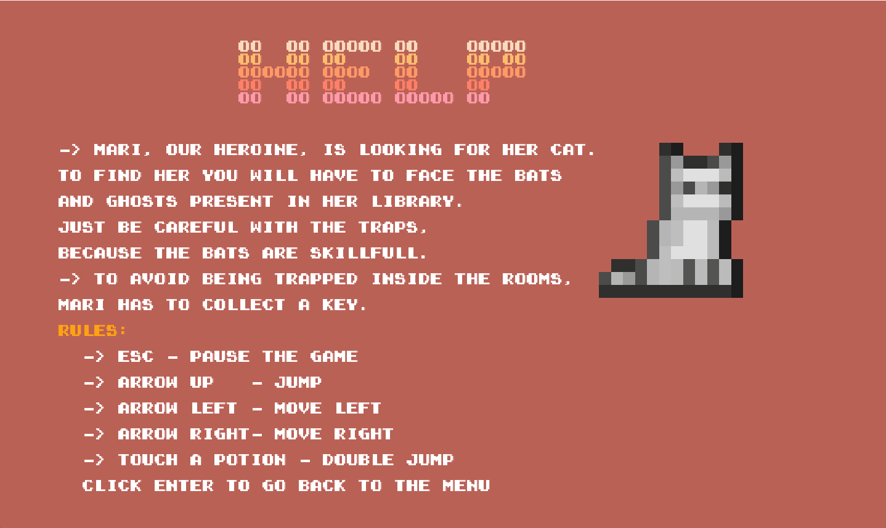
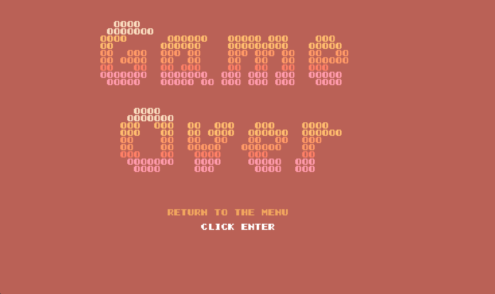
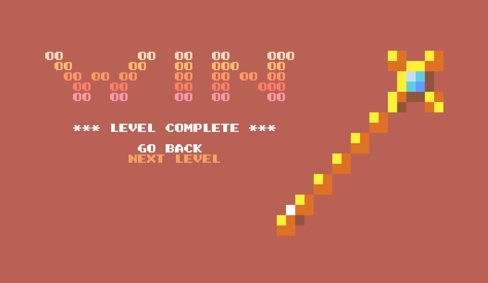
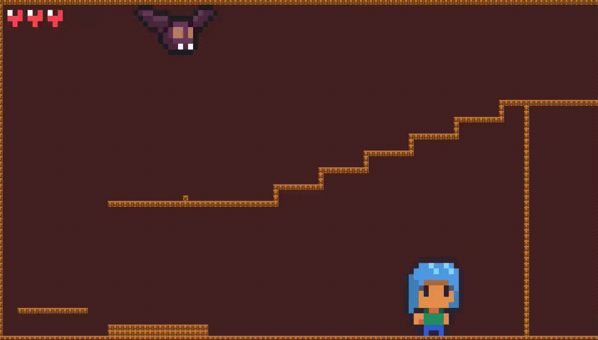
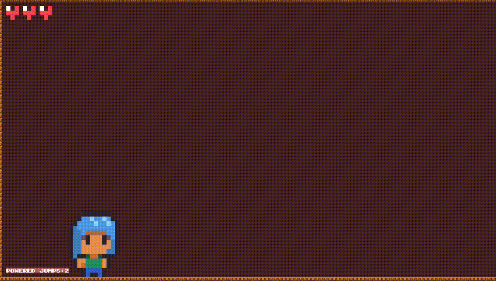

# PROJECT_L04GR08: Searching for Key-ty
Welcome to “Searching for Key-ty”, a game centered around the kidnapping of our protagonist cat. Embark on this amazing journey where Mari has to find her beloved kitten, finding the keys and moving through several rooms in a haunted mansion while trying to survive the monsters in her way.

This project for LDTS in 2022/2023 was developed by Teresa Mascarenhas (up202206828@fe.up.pt) and Sofia Gonçalves (up202205020@fe.up.pt).

## FEATURES
- [x] Menu - When the game starts a Menu is displayed (the player chooses between playing, seeing instructions or exiting)
- [x] Movement - The player (Mari) is able to move from left to right when the arrow keys are pressed.
- [x] Jumping - The player can jump when the up arrow key is pressed.
- [x] Platforms - The player can jump and walk across platforms, which are constantly moving.
- [x] Potions - Potions appear randomly on the map.
- [x] Player Collisions - If the player collides with a bat enemy or ghost enemy, he dies.
- [x] Bat Collisions - If the bat collides with Mari, it kills her.
- [x] Ghost Collisions - If the ghost collides with Mari, it kills her.
- [x] Map Edges - When an object goes beyond the edges of the map, on the x-axis, the game camera is moved from right to left.
- [x] Level victory - After getting the key, when the player manages to reach the door at the end of the map, the level is won and we can decide whether we want to play the next level or leave the game.
- [x] Lives - The player has a number of lives, which decreases with each death.
- [x] Game Over - When the player runs out of lives, the game ends.
- [x] Instructions - A page that shows the basic controls of the game.
- [x] Mari Flames - When mari touches a potion, we can see flames on the character during the jumping action.
- [x] Types of enemies - There are two types: Bat Enemies, which are warned when the player touches a certain trap, and Ghost Enemies, which move randomly, right and left.

## SCREENSHOTS
### Menus
**Initial Menu**

**Instructions**

**Game Over**

**Game win**

### Game preview

**Level 2**

**Potion Effect**

